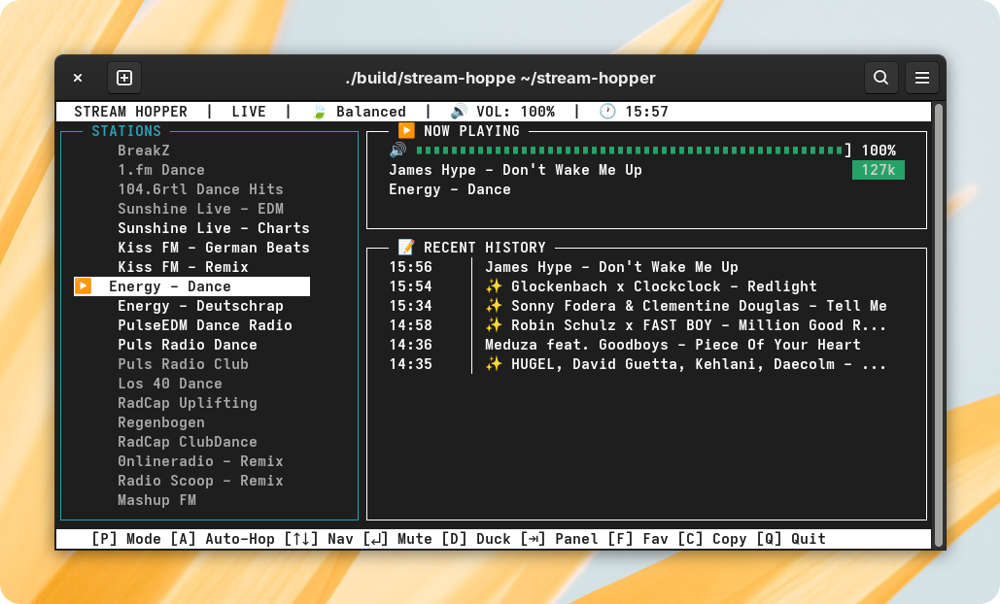

# 🐇 stream hopper

<div align="center">

</div>

a terminal-based radio player for discovering new music through human-curated live streams. hop between stations, automatically log every song, and break the algorithm's hold on your musical taste.

## 🧩 features

-   **⚡ instant station switching:** seamlessly hop between stations with smooth audio crossfades.
-   **✍️ external config:** manage your stations in a simple, comment-friendly `stations.jsonc` file.
-   **📝 automatic history:** every new song is logged to `radio_history.json` with a timestamp.
-   **⚙️ performance modes:** switch between `🍃 Balanced`, `🚀 Performance`, and `🎧 Focus` modes to manage resources.
-   **🤖 auto-hop discovery:** let the app cycle through stations for you for passive discovery.
-   **⭐ persistent favorites:** mark your favorite stations and they'll be saved for next time.
-   **🔗 multi-url fallbacks:** define multiple stream URLs per station and cycle them with `+`.
-   **🎨 responsive tui:** a polished `ncurses` interface that adapts to your terminal size.

## ⬇️ installation

you'll need a C++17 compiler, `make`, `pkg-config`, and the development libraries for `libmpv` and `ncurses`.

| distribution      | installation command                                                   |
| ----------------- | ---------------------------------------------------------------------- |
| **Debian/Ubuntu** | `sudo apt install build-essential libmpv-dev libncursesw5-dev pkg-config` |
| **Fedora/RHEL**   | `sudo dnf install gcc-c++ mpv-devel ncurses-devel pkg-config make`     |
| **Arch Linux**    | `sudo pacman -s gcc make pkg-config mpv ncurses`                         |

## 🛠️ build & run

1.  **compile the project**
    ```bash
    make
    ```
2.  **run the application**
    ```bash
    ./build/stream-hopper
    ```

## controls

| key     | action                                                        |
| :------ | :------------------------------------------------------------ |
| `↑` / `↓` | navigate stations / scroll history                          |
| `↵`     | mute / unmute the current station                           |
| `a`     | toggle auto-hop mode                                          |
| `p`     | cycle performance profiles (Balanced, Performance, Focus)     |
| `f`     | toggle favorite for the current station                       |
| `d`     | toggle audio ducking (temporarily lower volume)             |
| `+`     | cycle to the next available stream URL for the station        |
| `⇥`     | switch focus between Stations and History panels              |
| `c`     | enter Copy Mode (pauses UI for safe text selection)           |
| `q`     | quit                                                          |

## ⚙️ configuration

your personal setup lives in simple JSON files next to the executable:

-   `stations.jsonc`: **your station list.** this is the main file you'll edit.
-   `radio_history.json`: your complete, timestamped listening history.
-   `radio_favorites.json`: a list of your favorited station names.
-   `radio_session.json`: remembers the last station you were on.

### ✏️ editing your station list

modify `stations.jsonc` to build your personal radio universe.

```jsonc
// stations.jsonc
[
    {
        "name": "Sunshine Live - EDM",
        "urls": [
            "http://stream.sunshine-live.de/edm/mp3-192/stream.sunshine-live.de/",
            "http://stream.sunshine-live.de/edm/mp3-128/stream.sunshine-live.de/"
        ]
    },
    {
        "name": "Energy - Dance",
        "urls": ["https://edge01.streamonkey.net/energy-dance/stream/mp3"]
    }
]
```

## 🔧 technical details

-   **architecture:** thread-safe Actor Model with a unidirectional data flow.
-   **audio engine:** `libmpv`
-   **ui framework:** `ncurses` (with wide-character support)
-   **configuration:** `nlohmann/json` for persistence.
-   **concurrency:** modern C++ (`std::thread`, `std::mutex`, `std::condition_variable`).
-   **memory model:** RAII, smart pointers, and a clean ownership model.

## 🙏 acknowledgements

-   **[libmpv](https://mpv.io/)** - for the robust and powerful media playback engine.
-   **[ncurses](https://invisible-island.net/ncurses/)** - for the foundational terminal UI library.
-   **[nlohmann/json](https://github.com/nlohmann/json)** - for the excellent and easy-to-use JSON library.
-   **AI collaboration:** the architecture, code, and documentation were heavily shaped through conversation with large language models, primarily **Gemini 2.5 Pro** and **Claude 4 Sonnet**.
-   **all the radio stations** - for keeping real, human-curated music alive.

## 📜 license

this project is licensed under the Mozilla Public License 2.0 (MPL-2.0).

---

<div align="center">
 the algorithm knows what you liked yesterday. radio knows what you'll love tomorrow.
</div>
